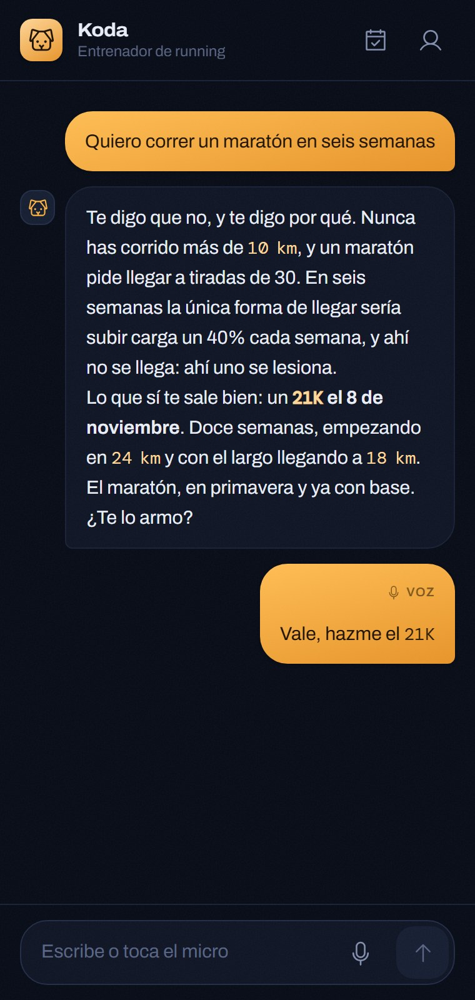
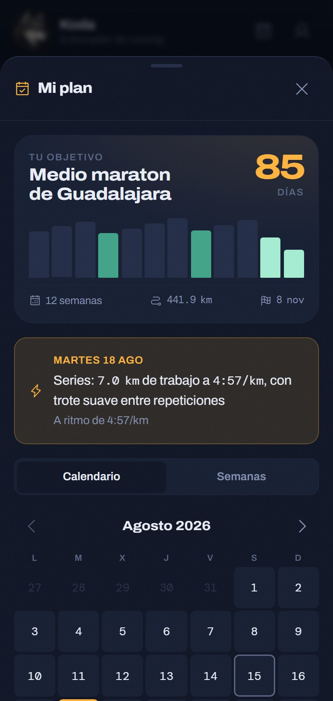
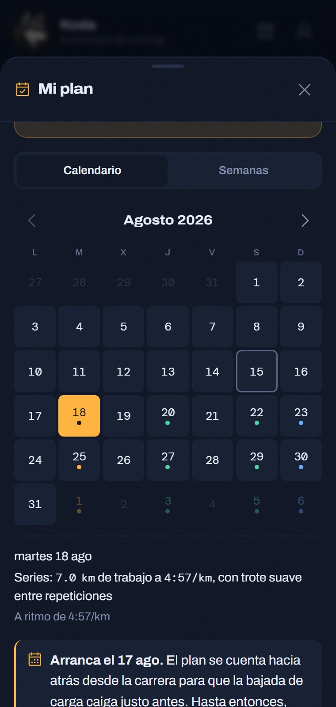
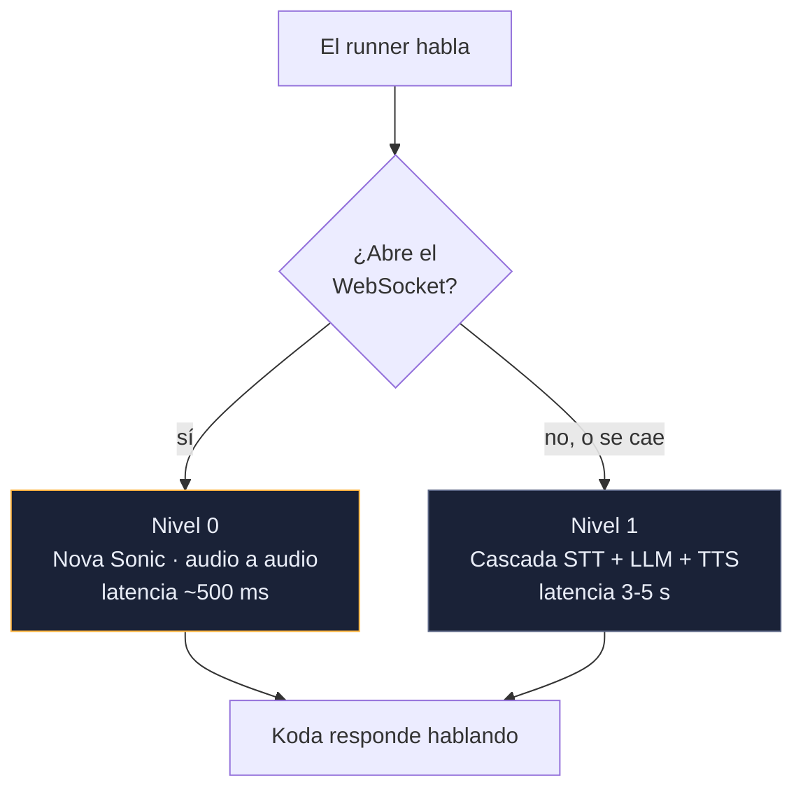
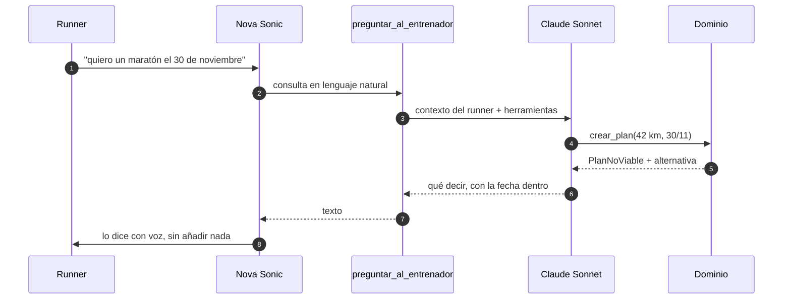
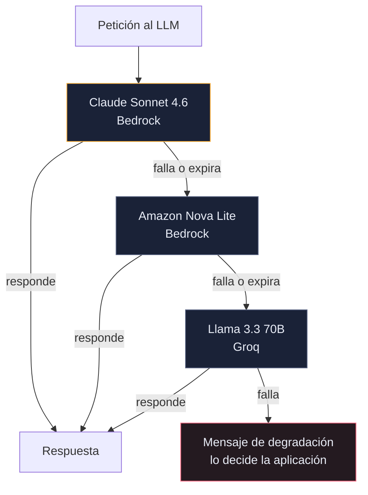
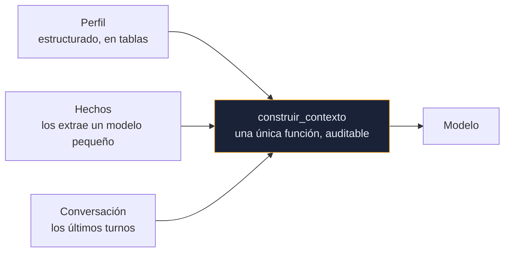

# Koda

**Un entrenador de running con el que se habla.** Le cuentas qué carrera quieres correr,
te calcula un plan real, se acuerda de lo que le dices y te escribe cada mañana con la
sesión del día.

**Aplicación desplegada:** https://44-208-133-232.sslip.io

<p align="center">
  
  
  
</p>

---

## Índice

- [Qué hace](#qué-hace)
- [La idea central](#la-idea-central)
- [El sistema completo](#el-sistema-completo)
- [El pipeline de voz](#el-pipeline-de-voz)
  - [Nivel 0: Nova Sonic habla, Sonnet decide](#nivel-0-nova-sonic-habla-sonnet-decide)
  - [Nivel 1: la cascada, y el gateway de modelos](#nivel-1-la-cascada-y-el-gateway-de-modelos)
- [El dominio de entrenamiento](#el-dominio-de-entrenamiento)
- [La memoria](#la-memoria)
- [Aislamiento entre usuarios](#aislamiento-entre-usuarios)
- [Levantarlo en local](#levantarlo-en-local)
- [Ponerlo en internet](#ponerlo-en-internet)
- [Tests](#tests)
- [Estructura del repositorio](#estructura-del-repositorio)
- [Decisiones de arquitectura](#decisiones-de-arquitectura)
- [Lo que no hace](#lo-que-no-hace)
- [Aviso](#aviso)

---

## Qué hace

| | |
|---|---|
| **Conversa por voz** | Audio en tiempo real con Amazon Nova Sonic. Mantienes pulsado el micrófono y responde hablando, en español |
| **Genera planes reales** | 5K, 10K, 21K y maratón: progresión, polarización, semanas de descarga y taper, con ritmos derivados de tu marca |
| **Se niega cuando toca** | Un maratón en seis semanas no es un plan, es una lesión. Koda lo rechaza y propone una distancia alcanzable el mismo día |
| **Recuerda** | Si le cuentas que te molesta la rodilla, sigue ahí semanas después. La conversación sobrevive a cerrar la pestaña |
| **Te escribe** | Sesión del día a las 6:00, check-in a las 20:00 y resumen los domingos, en tu hora local |
| **Lee tu reloj** | Le mandas una foto de la pantalla del reloj y da la sesión por hecha con los números que lee |
| **Se instala** | Es una PWA: se añade a la pantalla de inicio y abre a pantalla completa |

---

## La idea central

> **El modelo es la interfaz, no la fuente de verdad.**

Las reglas de entrenamiento viven en `app/domain/training/` como código determinista y
testeado. El modelo interpreta lo que quieres y te lo explica en voz alta, pero **no
calcula nada**: ni un ritmo, ni un kilometraje, ni una fecha.

Esto no es purismo. Un modelo que inventa un ritmo de tirada larga produce un número
que suena razonable y está mal, y nadie se entera hasta que alguien se lesiona. El
dominio, en cambio, se puede probar: si un test se pone en rojo, es que el plan que
Koda entregaría es malo para las piernas de alguien.

La consecuencia más visible es que **Koda sabe decir que no**:

> — Quiero correr un maratón el 30 de noviembre.
>
> — Con 15 semanas no alcanza para preparar un maratón de forma segura, necesitamos
> mínimo 16. Te propongo apuntar al medio maratón el mismo 30 de noviembre, que sí es
> muy viable con ese tiempo.

Ese rechazo no lo decide el modelo. Lo decide `PlanNoViable` en el dominio, y el modelo
solo lo cuenta.

---

## El sistema completo

Arquitectura hexagonal: el dominio no importa nada externo, y hay un test que lo
comprueba. Todo proveedor entra por un puerto y se ensambla en un único sitio,
`container.py`.

```mermaid
flowchart LR
    NAV["Navegador<br/>PWA instalable, sin framework<br/>micrófono por WebSocket, PCM 16 kHz"]

    subgraph servidor["Servidor"]
        API["Interfaces<br/>FastAPI, WebSocket, JWT"]
        APP["Aplicación<br/>casos de uso, contexto"]
        DOM["Dominio<br/>reglas R1-R8, puertos<br/>cero dependencias externas"]
        INF["Infraestructura<br/>adaptadores"]
        API --> APP
        APP --> DOM
        APP --> INF
        INF -. implementa .-> DOM
    end

    IA["Modelos<br/>Nova Sonic, Bedrock<br/>Transcribe, Polly, Groq"]
    NUBE["Servicios<br/>SES o SMTP, S3"]
    PG[("PostgreSQL")]

    NAV ==> API
    INF ==> IA
    INF ==> NUBE
    INF ==> PG

    style DOM fill:#1a2237,stroke:#ffb43f,color:#e9edf7
    style servidor fill:#0f1420,stroke:#232d47
```



La flecha que no existe es la importante: **el dominio no apunta a infraestructura**.
Define los puertos; los adaptadores los implementan. Cambiar SES por SMTP, o Transcribe
por Groq, es una variable de entorno y una línea en `container.py`.

Detalle en [ADR-003](docs/adr/ADR-003-arquitectura-hexagonal.md) y
[docs/contexto/01-ARQUITECTURA.md](docs/contexto/01-ARQUITECTURA.md).

---

## El pipeline de voz

Hay dos niveles. El rápido usa un modelo de audio a audio; si falla, el cliente cae solo
al de siempre, que es más lento pero está probado.



El cliente cuenta los fallos y solo desactiva el nivel 0 tras dos seguidos: un corte
puntual de red no puede condenar la sesión entera a la cascada.

### Nivel 0: Nova Sonic habla, Sonnet decide

Nova Sonic responde rápido, pero es un modelo de conversación, no de razonamiento: al
darle los datos del runner y las herramientas del dominio, se saltaba herramientas e
inventaba ritmos y fechas.

La solución fue quitarle aquello con lo que podía inventar. **Nova Sonic no sabe nada**:
ni quién es el runner, ni qué plan tiene, ni qué día es. Tiene una sola herramienta,
`preguntar_al_entrenador`, y su prompt le prohíbe decir un número que no venga de ella.
Detrás de esa herramienta está Claude Sonnet, con el contexto completo y las herramientas
de verdad.



Si el puente falla, la herramienta devuelve una frase que le ordena a Nova decir que no
puede consultar ahora mismo y **no inventar nada**. Un locutor sin respuesta se calla.

Y si Nova contesta sin llamar a la herramienta, el turno se rescata: se vuelve a pasar
por el puente antes de dejar que hable. La regla es que ninguna afirmación con datos
salga de un modelo que no los tiene.

Detalle en [ADR-020](docs/adr/ADR-020-nova-habla-y-sonnet-decide.md) y
[ADR-013](docs/adr/ADR-013-prompt-propio-para-el-modelo-de-voz.md).

### Nivel 1: la cascada, y el gateway de modelos

La ruta de respaldo es la clásica: audio a texto, texto al modelo, respuesta a audio.
El paso del modelo no es una llamada suelta, sino **una cadena ordenada de proveedores
con timeout por intento**.



No es reintentar la misma llamada: son **proveedores distintos**, uno de ellos fuera de
AWS, porque una caída de Bedrock no se arregla llamando otra vez a Bedrock. Los tiers
opcionales se saltan si no están configurados, así que el gateway funciona igual con un
solo modelo.

El gateway no sabe español ni de interfaz: si todos fallan, propaga la excepción y es la
capa de aplicación la que decide qué se le dice al runner.

Detalle en [ADR-011](docs/adr/ADR-011-nova-sonic-y-gateway-de-modelos.md).

---

## El dominio de entrenamiento

Ocho reglas, todas en código, todas con tests escritos antes que la implementación.

| | Regla | Qué impone |
|---|---|---|
| R1 | Progresión del 10 % | El volumen semanal no sube más de ~10 % sobre la semana anterior |
| R2 | Polarización 80/20 | ~80 % del volumen fácil, ~20 % a intensidad alta |
| R3 | Semana de descarga | Cada 3-4 semanas se recorta el volumen ~30 % |
| R4 | Taper | Las últimas 2-3 semanas baja el volumen, no la intensidad |
| R5 | Ritmos derivados | De una marca reciente salen todos los ritmos, por Riegel |
| R6 | Mínimos por distancia | Sin semanas suficientes, el sistema se niega y propone alternativa |
| R7 | Al menos un día de descanso | Nunca siete días de carrera para un principiante |
| R8 | La tirada larga tiene techo | No más del ~35 % del volumen semanal en una sesión |

Las reglas se contradicen entre sí, y esas contradicciones están resueltas por escrito en
[ADR-012](docs/adr/ADR-012-tensiones-entre-reglas-de-entrenamiento.md) en lugar de
quedar al azar del orden en que se aplican.

**Sin marca reciente los ritmos se estiman por nivel**, y Koda tiene que decirlo en voz
alta: es la diferencia entre un dato y una suposición. Una marca que da un ritmo
imposible se rechaza al guardarla y, si aun así llegara al dominio, se ignora en vez de
romper el plan.

Detalle en [docs/contexto/02-DOMINIO-RUNNING.md](docs/contexto/02-DOMINIO-RUNNING.md) y
[ADR-006](docs/adr/ADR-006-dominio-determinista.md).

---

## La memoria

Tres capas con propósitos distintos, porque meterlo todo en el prompt es caro y además
no funciona.



El perfil es la verdad estructurada. Los hechos son lo que el runner cuenta de pasada
—una molestia, un viaje, que odia las cuestas— y los extrae un modelo barato, no el
grande. La conversación da continuidad inmediata y sobrevive a cerrar la pestaña.

Que **una sola función** ensamble el contexto no es estética: es lo que hace auditable
que ahí dentro no se cuele nada de otro usuario.

Detalle en [ADR-005](docs/adr/ADR-005-memoria-tres-capas.md) y
[ADR-021](docs/adr/ADR-021-una-sola-conversacion-por-runner.md).

---

## Aislamiento entre usuarios

Cinco capas, y una suite de tests que intenta romperlas:

1. **Repositorios** — ningún método consulta datos personales sin `runner_id` en la firma
2. **HTTP** — la identidad sale del JWT, nunca del cuerpo, la query ni una cabecera
3. **Contexto del modelo** — lo ensambla una única función auditada
4. **Archivos** — URLs firmadas con caducidad y comprobación de propiedad
5. **Avisos programados** — cada job va acotado a su runner y recarga los datos por id

```bash
pytest tests/security -v
```

Los tests de seguridad no comprueban que el camino feliz funcione: mandan el `runner_id`
de otro usuario en el cuerpo, piden el plan ajeno, reutilizan tokens caducados. Un test
de seguridad que solo prueba lo que debería pasar no prueba nada.

Detalle en
[docs/contexto/03-MULTIUSUARIO-Y-SEGURIDAD.md](docs/contexto/03-MULTIUSUARIO-Y-SEGURIDAD.md).

---

## Levantarlo en local

**Requisitos:** Python 3.12 o superior, PostgreSQL, y una cuenta de AWS con acceso a
Bedrock, Transcribe, Polly y SES.

```powershell
git clone https://github.com/mateomartin21/Chatbot-Koda.git
cd Chatbot-Koda

python -m venv .venv
.\.venv\Scripts\Activate.ps1
pip install -r requirements.txt

Copy-Item .env.example .env
# rellena .env con tus credenciales

python scripts/smoke_aws.py    # comprueba que AWS responde antes de nada
alembic upgrade head
uvicorn app.main:app --reload
```

La portada pública queda en `http://localhost:8000` y la aplicación en
`http://localhost:8000/app/`. Se entra con un enlace que llega por correo: no hay
contraseñas.

> **Desde el móvil hace falta HTTPS.** `getUserMedia` solo existe en un origen seguro, y
> la excepción de `localhost` no vale desde otro dispositivo. Sin certificado, Koda no
> puede oír a nadie desde un teléfono.

---

## Ponerlo en internet

Tres contenedores en una instancia EC2: PostgreSQL, la aplicación y Caddy, que pide el
certificado a Let's Encrypt al arrancar y lo renueva solo. **No hace falta comprar
dominio**: con `sslip.io`, el nombre se deriva de la IP.

```bash
git clone https://github.com/mateomartin21/Chatbot-Koda.git koda && cd koda
nano .env                       # DOMINIO, APP_BASE_URL y las credenciales
docker compose up -d --build
```

Las migraciones se aplican en un contenedor aparte que corre y termina. Si una falla, la
aplicación no arranca: un fallo de despliegue tiene que verse como un fallo de
despliegue, no como una aplicación que contesta 500 a todo.

El runbook completo —grupo de seguridad, IP elástica, qué mirar cuando algo falla— está
en **[docs/DESPLIEGUE.md](docs/DESPLIEGUE.md)**. El porqué, y por qué se descartaron App
Runner y Lambda, en [ADR-019](docs/adr/ADR-019-una-instancia-y-caddy-para-el-https.md).

---

## Tests

```powershell
pytest                      # 213 tests
pytest tests/security -v    # aislamiento entre usuarios
ruff check . ; ruff format .
```

**La suite corre sin internet y sin gastar créditos.** Ningún test llama a AWS: todo
proveedor tiene su doble en `tests/fakes/`. Un test que necesita una credencial no es un
test, es una factura.

Hay además un test que comprueba que `app/domain/` no importa nada externo, y otro que
construye el contenedor entero sin una sola credencial configurada. Ese segundo salió de
un fallo real de CI.

---

## Estructura del repositorio

```
app/
├── domain/            reglas de entrenamiento y puertos. Cero dependencias externas
│   ├── training/      R1-R8, ritmos, estrategias por distancia
│   └── ports/         las interfaces que la infraestructura implementa
├── application/       casos de uso y construcción del contexto
├── infrastructure/    adaptadores: Bedrock, Nova Sonic, Transcribe, Polly, SES, SMTP,
│                      Groq, PostgreSQL, S3, APScheduler
├── interfaces/        API HTTP, WebSocket de voz y web
│   └── web/           portada pública en /, aplicación en /app/
├── prompts/           prompts versionados, en Markdown, nunca en el código
└── container.py       el único sitio que conoce las implementaciones concretas

tests/{unit,integration,security,fakes}/
docs/{contexto,adr}/   contexto del proyecto y 22 decisiones documentadas
```

---

## Decisiones de arquitectura

Veintidós decisiones, cada una con su contexto, sus alternativas descartadas y **sus
consecuencias negativas**. Un ADR sin consecuencias negativas es publicidad, no
ingeniería. Un ADR nunca se edita: cuando cambia la decisión, otro lo supersede.

| ADR | Decisión |
|---|---|
| [001](docs/adr/ADR-001-pipeline-cascada.md) | Pipeline en cascada en lugar de speech-to-speech — *superseded por 011* |
| [002](docs/adr/ADR-002-python-fastapi.md) | Python y FastAPI, frontend sin framework |
| [003](docs/adr/ADR-003-arquitectura-hexagonal.md) | Arquitectura hexagonal para aislar a los proveedores de IA |
| [004](docs/adr/ADR-004-aws-servicios-gestionados.md) | Servicios gestionados de AWS |
| [005](docs/adr/ADR-005-memoria-tres-capas.md) | Memoria en tres capas |
| [006](docs/adr/ADR-006-dominio-determinista.md) | Reglas de entrenamiento deterministas |
| [007](docs/adr/ADR-007-auth-enlace-magico.md) | Autenticación por enlace mágico |
| [008](docs/adr/ADR-008-entradas-multimodales.md) | Entradas multimodales |
| [009](docs/adr/ADR-009-groq-stt-temporal.md) | Groq Whisper como STT temporal |
| [010](docs/adr/ADR-010-sin-dominio-propio-para-ses.md) | Sin dominio propio para SES: se acepta el riesgo de spam |
| [011](docs/adr/ADR-011-nova-sonic-y-gateway-de-modelos.md) | Voz en tiempo real con Nova Sonic y gateway de modelos con fallback |
| [012](docs/adr/ADR-012-tensiones-entre-reglas-de-entrenamiento.md) | Cómo se resuelven las contradicciones entre R1 y R8 |
| [013](docs/adr/ADR-013-prompt-propio-para-el-modelo-de-voz.md) | Un prompt propio para el modelo de voz, y herramientas donde el fallo no cabe |
| [014](docs/adr/ADR-014-jobs-en-memoria.md) | Los avisos programados viven en memoria y se reconstruyen al arrancar |
| [015](docs/adr/ADR-015-direccion-visual-y-presupuesto-de-movimiento.md) | Dirección visual propia y presupuesto de movimiento — *superseded por 016* |
| [016](docs/adr/ADR-016-el-acento-se-aleja-del-naranja-de-strava.md) | El acento se aleja del naranja de Strava, y seis animaciones más |
| [017](docs/adr/ADR-017-la-foto-se-reprocesa-antes-de-salir.md) | La foto se reprocesa antes de salir del servidor |
| [018](docs/adr/ADR-018-koda-tiene-cara-y-la-app-se-instala.md) | Koda tiene cara, y la aplicación se instala en el móvil |
| [019](docs/adr/ADR-019-una-instancia-y-caddy-para-el-https.md) | Una instancia EC2 con Caddy, y el HTTPS sin comprar dominio |
| [020](docs/adr/ADR-020-nova-habla-y-sonnet-decide.md) | Nova Sonic habla, el modelo grande decide |
| [021](docs/adr/ADR-021-una-sola-conversacion-por-runner.md) | Una sola conversación por runner, que sobrevive a cerrar la pestaña |
| [022](docs/adr/ADR-022-el-correo-tiene-que-llegar-a-cualquiera.md) | El correo tiene que llegarle a alguien cuyo correo no se sabe |

El contexto completo del proyecto, en cinco minutos de lectura, está en
[docs/contexto/00-CONTEXTO.md](docs/contexto/00-CONTEXTO.md).

---

## Lo que no hace

Fuera del alcance de esta entrega. Se documentan porque saber dónde están los límites
importa tanto como lo construido:

- **Editar el plan sin regenerarlo.** Pedir otro plan reemplaza al anterior: no se puede
  mover una sesión ni decir "esta semana viajo". Es una decisión, no un olvido — un plan
  es el resultado de un cálculo completo, y editarlo suelto abre la puerta a planes que
  ya no cumplen R1-R8. La forma correcta es una herramienta que **vuelva a pasar por el
  dominio**, no un editor de sesiones.
- **Interrumpir a Koda mientras habla.** Nova Sonic soporta barge-in; el cliente todavía
  no lo implementa.
- **Recuperación semántica de memoria** con embeddings, cuando los hechos por usuario
  crezcan lo suficiente para que buscar por relevancia gane a mandarlos todos.
- **Caducidad de los hechos.** Hoy se deduplican y se pueden marcar no vigentes, pero
  nada caduca solo: una lesión de hace ocho meses no debería condicionar el plan de hoy.
- **Escalar horizontalmente.** El scheduler vive en memoria, así que la aplicación corre
  con un solo worker. Sacarlo del proceso es el primer cambio si esto tuviera que crecer.
- **Integración con Strava o Garmin**, que sustituiría el registro por foto.

---

## Aviso

Koda ofrece orientación de entrenamiento, **no consejo médico**. Ante dolor persistente
o una lesión, consulta a un profesional de la salud.

---

*Prueba técnica · agosto de 2026*
