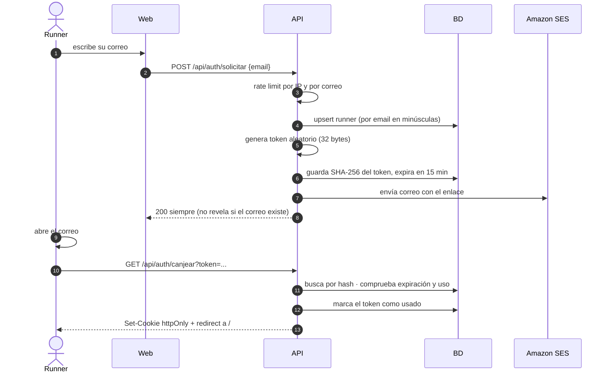

# 03 · Multiusuario, identidad y aislamiento

> **El documento más importante del repo de cara a una entrevista.** Aquí se resuelve el problema que originó la v3: sin usuarios, la memoria a largo plazo es global y los datos de un runner contaminan las conversaciones de otro.

---

## 1. El problema, con nombre y apellidos

Sin autenticación, la tabla `memoria_hechos` no tiene a quién pertenecer. Si el runner A menciona *"me duele la rodilla derecha"* y el runner B abre la app, el constructor de contexto trae los hechos de **todos** y el coach le dice a B que cuide una rodilla que nunca se lesionó.

Eso no es un fallo de comodidad. Es:

- **Una fuga de datos personales** — B lee información de salud de A.
- **Una corrupción del producto** — los planes se generan con datos de otra persona.
- **Un fallo silencioso** — no lanza excepción, no aparece en los logs. Funciona "bien" y está mal.

**Los fallos silenciosos son los peligrosos.** Por eso la mitigación no puede ser "acordarse de filtrar": tiene que ser estructural y verificada por tests.

---

## 2. Modelo de identidad

| Decisión | Valor |
|---|---|
| **Identidad** | El correo electrónico. Es también el canal de recordatorios, así que ya lo necesitábamos |
| **Autenticación** | **Enlace mágico** (magic link) — sin contraseñas |
| **Sesión** | JWT firmado, en cookie `httpOnly` + `Secure` + `SameSite=Lax` |
| **Frontera de aislamiento** | `runner_id` (UUID). Toda fila de datos personales cuelga de él |

### Por qué enlace mágico y no contraseña ni Cognito

- **Ya tienes SES montado** para los recordatorios. La autenticación sale casi gratis del mismo componente.
- **No almacenas contraseñas** → desaparece toda una clase de vulnerabilidades (hashing débil, reutilización, filtraciones, recuperación de contraseña).
- **Verifica el correo por diseño.** Y necesitas correos verificados de todos modos: mandar recordatorios a una dirección no verificada es spam y destroza la reputación de envío.
- **Cognito** sería "la forma AWS", pero user pools + hosted UI + verificación de JWKS se come fácilmente un día de los cuatro. Descartado por tiempo, documentado en [ADR-007](../adr/ADR-007-auth-enlace-magico.md).

**En una frase para la entrevista:** *"Elegí enlace mágico porque unifica identidad, verificación de correo y canal de notificaciones en un solo componente que ya necesitaba."*

---

## 3. Flujo de autenticación



### Detalles que separan una implementación buena de una ingenua

| Detalle | Por qué |
|---|---|
| **Guardar el hash del token, no el token** | Si te roban la BD, no pueden iniciar sesión como nadie |
| **Ventana de 15 minutos** (`expira_en`) | Fue de un solo uso hasta [ADR-024](../adr/ADR-024-el-enlace-magico-vale-durante-su-ventana.md): los antivirus de correo abren los enlaces para analizarlos, gastaban el único uso y dejaban fuera al destinatario. `usado_en` se sigue guardando, pero solo para auditar |
| **Expiración de 15 min** | Ventana corta de ataque |
| **Respuesta 200 siempre** | No revelar qué correos están registrados (enumeración de usuarios) |
| **Rate limit** (5/hora por correo, 20/hora por IP) | Evitar que te usen como máquina de spam y quemen tu cuota de SES |
| **`secrets.token_urlsafe(32)`** | Aleatoriedad criptográfica. **Nunca** `random` ni `uuid4` como secreto |
| **Comparación en tiempo constante** | `secrets.compare_digest` al validar |

```python
import secrets, hashlib
from datetime import datetime, timedelta, timezone

def crear_token() -> tuple[str, str, datetime]:
    """Devuelve (token_en_claro, hash_para_bd, expiracion)."""
    token = secrets.token_urlsafe(32)
    token_hash = hashlib.sha256(token.encode()).hexdigest()
    expira = datetime.now(timezone.utc) + timedelta(minutes=15)
    return token, token_hash, expira
```

### La cookie de sesión

```python
response.set_cookie(
    key="koda_session",
    value=jwt_firmado,
    httponly=True,      # JavaScript no puede leerla → mitiga XSS
    secure=True,        # solo por HTTPS
    samesite="lax",     # mitiga CSRF
    max_age=60 * 60 * 24 * 30,
    path="/",
)
```

`httponly=True` es la línea que impide que un XSS robe la sesión. Si la guardas en `localStorage`, cualquier script inyectado se la lleva.

---

## 4. Aislamiento: los cinco sitios donde se filtra

Filtrar datos entre usuarios **no es un solo bug**, son cinco superficies distintas. Cada una necesita su defensa.

### 4.1 La base de datos

**Regla:** ningún repositorio expone un método que consulte datos personales sin `runner_id`.

```python
# ❌ MAL — invita al desastre
def obtener_plan(plan_id: UUID) -> Plan: ...

# ✅ BIEN — el aislamiento es parte de la firma
def obtener_plan(runner_id: UUID, plan_id: UUID) -> Plan | None: ...
```

Si la firma no permite consultar sin `runner_id`, el bug **no se puede escribir**. Eso es diseño defensivo: no confíes en recordar, haz que olvidarse sea imposible.

### 4.2 El endpoint HTTP (IDOR)

**Regla de oro:** `runner_id` sale **siempre** del JWT, **nunca** del cuerpo, la query o una cabecera.

```python
# interfaces/api/deps.py
async def get_current_runner(request: Request, repos: Repos = Depends()) -> Runner:
    token = request.cookies.get("koda_session")
    if not token:
        raise HTTPException(401, "No autenticado")
    try:
        payload = jwt.decode(token, settings.jwt_secret, algorithms=["HS256"])
    except jwt.PyJWTError:
        raise HTTPException(401, "Sesión inválida")
    runner = await repos.runners.obtener(UUID(payload["sub"]))
    if runner is None or not runner.activo:
        raise HTTPException(401, "Sesión inválida")
    return runner


# interfaces/api/mensajes.py
@router.post("/api/mensajes")
async def enviar_mensaje(
    runner: Runner = Depends(get_current_runner),   # ← única fuente de identidad
    audio: UploadFile | None = File(None),
    texto: str | None = Form(None),
):
    msg = MensajeEntrante(runner_id=runner.id, audio=audio, texto=texto)
    return await procesar_mensaje(msg)
```

Si algún día ves un `runner_id` llegando en el `body`, es un **IDOR** (Insecure Direct Object Reference): el usuario A pone el id de B y lee sus datos. Es de los fallos más comunes en aplicaciones reales.

### 4.3 El contexto del LLM

Es la superficie **específica de este proyecto** y la que casi nadie piensa. Aunque la BD esté bien aislada, si el constructor de contexto mete hechos de más, el modelo los va a usar.

```python
# application/contexto.py
async def construir_contexto(runner_id: UUID) -> ContextoConversacion:
    """El ÚNICO sitio que ensambla el contexto del LLM.
    Recibe runner_id y no acepta ninguna otra fuente de datos personales."""
    perfil   = await repos.runners.obtener(runner_id)
    plan     = await repos.planes.activo(runner_id)
    recientes= await repos.conversaciones.ultimos(runner_id, limite=10)
    hechos   = await repos.memoria.vigentes(runner_id)
    return ContextoConversacion(perfil, plan, recientes, hechos)
```

Una sola función, un solo parámetro de identidad. Cualquier fuga tendría que pasar por aquí, así que aquí es donde se audita.

### 4.4 Los archivos (audio e imágenes)

El MP3 de Polly y las fotos que sube el usuario **son datos personales**.

- ❌ `GET /static/audio/1042.mp3` — cualquiera itera los números y escucha conversaciones ajenas.
- ✅ Claves opacas con UUID **y** verificación de propiedad antes de servir, o **URLs firmadas de S3 con caducidad corta** (5–15 min).

```python
@router.get("/api/audio/{audio_id}")
async def obtener_audio(audio_id: UUID, runner: Runner = Depends(get_current_runner)):
    key = await repos.conversaciones.audio_key(runner.id, audio_id)  # scoped
    if key is None:
        raise HTTPException(404)          # 404, no 403: no confirmes que existe
    return RedirectResponse(storage.url_firmada(key, ttl=600))
```

Devolver **404 y no 403** para recursos ajenos evita confirmar su existencia.

### 4.5 El scheduler

Cada job de APScheduler lleva su `runner_id` y el caso de uso vuelve a cargar los datos acotados. Nunca un job que haga `SELECT * FROM sesiones WHERE fecha = hoy` y luego reparta correos por su cuenta: eso es un cruce de destinatarios esperando a ocurrir.

---

## 5. Tests de seguridad — la carpeta que impresiona

Crea `tests/security/`. Que exista ya dice algo de ti; que pase, más.

```python
# tests/security/test_aislamiento.py

async def test_un_runner_no_ve_el_plan_de_otro(cliente, runner_a, runner_b):
    plan_b = await crear_plan(runner_b)
    r = await cliente.get(f"/api/plan/{plan_b.id}", cookies=sesion(runner_a))
    assert r.status_code == 404          # ni 200 ni 403

async def test_el_contexto_solo_trae_hechos_del_runner(repos, runner_a, runner_b):
    await repos.memoria.guardar(runner_b.id, "le duele la rodilla derecha")
    ctx = await construir_contexto(runner_a.id)
    assert all(h.runner_id == runner_a.id for h in ctx.hechos)
    assert "rodilla" not in ctx.render()

async def test_el_body_no_puede_suplantar_la_identidad(cliente, runner_a, runner_b):
    r = await cliente.post(
        "/api/mensajes",
        data={"texto": "hola", "runner_id": str(runner_b.id)},   # intento de IDOR
        cookies=sesion(runner_a),
    )
    turno = await ultimo_turno()
    assert turno.runner_id == runner_a.id   # el body se ignoró

async def test_el_token_magico_es_de_un_solo_uso(cliente, token):
    assert (await cliente.get(f"/api/auth/canjear?token={token}")).status_code in (200, 307)
    assert (await cliente.get(f"/api/auth/canjear?token={token}")).status_code == 401

async def test_el_token_magico_caduca(cliente, token_expirado):
    assert (await cliente.get(f"/api/auth/canjear?token={token_expirado}")).status_code == 401

async def test_el_audio_ajeno_devuelve_404(cliente, runner_a, audio_de_b):
    r = await cliente.get(f"/api/audio/{audio_de_b}", cookies=sesion(runner_a))
    assert r.status_code == 404
```

**Sobre el segundo test:** el `assert "rodilla" not in ctx.render()` es el que de verdad demuestra que entendiste el problema, porque comprueba el texto final que llega al modelo, no solo la consulta SQL.

---

## 6. Otras superficies que un evaluador va a mirar

| Riesgo | Mitigación |
|---|---|
| **Abuso de coste** | Rate limit por runner (ej. 30 mensajes/hora). Cada mensaje de voz cuesta dinero en Transcribe + Bedrock + Polly |
| **Subidas maliciosas** | Validar tamaño y tipo real por *magic bytes*, no por extensión. Ver [04](04-ENTRADAS-MULTIMODALES.md) |
| **Inyección de prompt** | El texto del usuario va en un bloque de mensaje de usuario, nunca concatenado dentro del system prompt. Las herramientas validan sus argumentos en el dominio: aunque el modelo pida un plan absurdo, `PlanNoViable` lo frena |
| **XSS en el chat** | La respuesta del coach se inserta con `textContent`, nunca con `innerHTML` |
| **CSRF** | `SameSite=Lax` + los endpoints que mutan son `POST` |
| **Secretos en el repo** | `.env` en `.gitignore` desde el primer commit. Si se escapa una llave, **rótala** — borrarla del historial no basta |
| **Datos personales** | Endpoints de exportar y borrar cuenta (§7). La foto sube sin EXIF (ver [04](04-ENTRADAS-MULTIMODALES.md)) |
| **Logs** | Nunca registres el contenido de las conversaciones ni los tokens. Registra `runner_id` y `request_id` |

---

## 7. Derechos sobre los datos

Dos endpoints pequeños que dicen mucho:

```
GET    /api/mi-cuenta/exportar   → JSON con todo lo del runner (perfil, planes, conversaciones, hechos)
DELETE /api/mi-cuenta            → borrado en cascada + baja de recordatorios, con confirmación
```

Son ~30 líneas y demuestran que piensas en el usuario y en la normativa de protección de datos, no solo en el *happy path*. Súmale el enlace de baja en cada correo (ver [05](05-MEMORIA.md) y las plantillas).

---

## 8. Resumen para defender en la entrevista

> *"El aislamiento entre usuarios no lo resolví recordando filtrar. Lo resolví en cinco capas: la firma de los repositorios hace imposible consultar sin `runner_id`; la identidad sale solo del JWT, nunca del cuerpo; el contexto del LLM se ensambla en una única función auditada; los archivos se sirven con URLs firmadas y comprobación de propiedad; y los jobs del scheduler van acotados por runner. Y lo verifiqué con una carpeta `tests/security/` donde un test comprueba que los hechos de un usuario nunca aparecen en el prompt de otro."*
